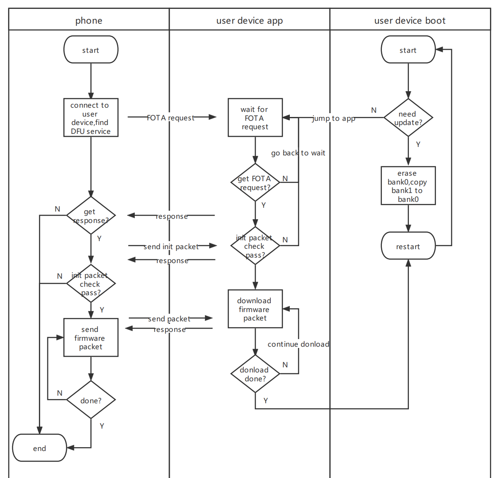

# BLE-FOTA-background


## 概述

FOTA是指通过无线通信的方式（2G/3G/4G/BLE/NB...）进行设备升级，蓝牙是实现FOTA最方便的方式之一，因此这里我们基于Nordic 52832蓝牙芯片来实现FOTA的功能。

### FOTA一般分为3种方案

* 1.非后台单区FOTA

<br>

这种方式需要用户程序先跳转到boot区，开始升级之后，先将app区删除，然后通过蓝牙接收新的固件并将固件数据写入到app区，升级完成后重启并跳转到app区。

这种方式比较节省ROM空间，但是升级失败会导致app丢失，升级过程中app停止运行

* 2.非后台双区FOTA

<br>

这种方式有一个额外的bank用于保存接收到的固件数据，在固件接收完毕后再擦除bank0，将bank1的数据复制到bank0。

相较于方式1，非后台双区FOTA在升级失败的情况下原app依然可以恢复工作，但是需要一个额外的bank，对ROM大小有一定的要求

* 3.后台式双区FOTA

<br>

这种方式将升级过程拆解为了两个过程，一个是固件下载过程，一个是固件更新过程，固件下载是在app下完成的，固件更新是在boot下完成的。固件下载过程中app是可以正常运行的，只有在下载成功之后app才会跳转到boot，由boot完成最后的固件更新。

相较于方式2，后台式FOTA解决了升级过程中app无法运行的问题。

在选择升级方式的时候，大家需要根据自己设备的外设情况来选择合适的升级方式，本教程将采用后台式FOTA。

##  flash layout

为了让大家更加清楚的了解FOTA过程中ROM中数据的变化过程，这里先讲解ROM中的内存分布以及各个内存块的作用。

nordic 52832 ROM空总共512KByte，由于flash擦写时是以4K为单位执行，因此我们将4K称为page，共计128page，按照功能，可分为7个内存块，它们分别是：

* 1.MBR区(Master Boot Record)：

内存：4K [0x00000000,0x00001000)

MBR区存储了当前程序是否存在boot loader，以及boot loader的起始地址，如果存在boot loader，将会引导程序进入boot loader，否则将会直接将程序引导至app区。MBR区的物理地址是固定的，即ROM空间的第一个page。

* 2.SoftDevice区：

内存：148K [0x00001000,0x00026000)

SoftDevice区用于存储蓝牙协议栈，由于本项目需要通过蓝牙传输固件升级包，所以soft device是必需的，由于nordic芯片独特的软件架构，soft device的物理地址是固定的，不同的芯片型号，物理地址有所不同。

* 3.UserData区：

内存：4K [0x0007D000,0x0007E000)

UserData区用于存储项目相关的私有数据,大小以及物理地址可以自由调整，但是要以page为单位，其实地址必须按照page对齐，这里我们只需要一个page即可，物理地址设置为ROM空间的倒数第三个page。

* 4.boot loader区

内存：24K [0x00077000,0x0007D000)

boot loader是主程序的引导程序，后台式FOTA方案中通过蓝牙下载固件的过程是在app下完成的，因此boot loader不需要集成蓝牙射频功能，也就不需要运行协议栈相关的代码，因此内存分配可以小一点，如果是非后台式的FOTA方案，无论单区还是双区模式，boot loader的内存分配都要更大一点，这里我们只需要分配6个page即可。

* 5.settings区

内存：4K [0x0007F000,0x00080000)

settings区位于整个ROM空间的最后1个page，用于存储和版本相关的详细信息，这些信息总共约900个byte，由于flash擦写特性是以4K为单位，因此分配4K的ROM空间

* 6.setting backup区

内存：4K [0x0007E000,0x0007F000)

settings backup区位于整个ROM空间的倒数第二个page，是settings page的备份，如果settings page由于误操作或者电磁辐射等原因导致数据丢失，可以从settings pickup page恢复数据。

* 7.app区

内存：324K [0x00026000,0x00077000)

除了以上的内存块以外，剩余的部分都是app区，也就是我们的主程序区，由于我们采用的后台式双区FOTA方案，必需要有数据备份，因此实际我们的app代码大小不能超过160K。（实际剩余324K，为什么app最大为160K而不是162K呢？这一段描述有不严谨的地方，希望你能发现它）

## 环境配置

* 1.mcu

Nordic 52832

由于本项目不涉及任何的物理外设（时钟源为内部低速时钟），因此你需要找到任何一块基于52832的开发板，就可以实现本项目中的后台式FOTA功能，如果你身边没有52832的开发板，也可以用52840，52810等52系列开发板代替。

文档下载链接 https://www.nordicsemi.com/Products/nRF52832/Getting-started

* 2.SDK

version: 16.0.0（仓库中已上传）

目前SDK17已经更新，使用SDK17也可。

下载链接 https://www.nordicsemi.com/Products/Development-software/nRF5-SDK

* 3.编译工具

  * gcc

  * python
    * nrfutil


##  FOTA流程

在开始code之前，我们需要明确后台式FOTA的具体流程，大致的工作流如下。

<br>

下面我们再展开讲述FOTA过程中的一些细节问题。

* 1.生成加密公私钥对

FOTA升级又分为开放式FOTA和安全式FOTA，开放式升级方式不对固件的安全性做校验，会直接下载到备份区，并在下载完成后覆盖当前的app区，这种方式一般不推荐，因为任何人都可以通过抓包的方式抓取升级时的init packet，获取升级包的打包参数，伪造固件升级包，进而将设备完全改写。因此本项目将使用安全式FOTA，通过公私钥对生成签名保存到固件升级包中，固件下载完成后通过验签的方式判断当前固件是否安全，验签失败的固件将会直接丢弃。

生成公私钥对的工具为nrfutil,通过
```python
pip install nrfutil
```
安装nrfutil,安装完成后，终端输入
```python
nrfutil version
```
确认版本信息，确认无误后，通过
```python
nrfutil keys generate priv.pem
```
生成私钥文件"prin.pem"，通过
```python
nrfutil keys display --key pk --format code priv.pem --out_file fota_public_key.c
```
生成公钥文件"fota_public_key.c".

至此我们已经生成了公私钥对，这对密钥一定要保存好，之后打包升级包的时候需要用到，本项目中为了方便自动化编译，将公私钥对放在工程目录下，大家在实操过程中一定要自己生成一对属于自己的密钥对。

* 2.生成micro-ecc算法库
